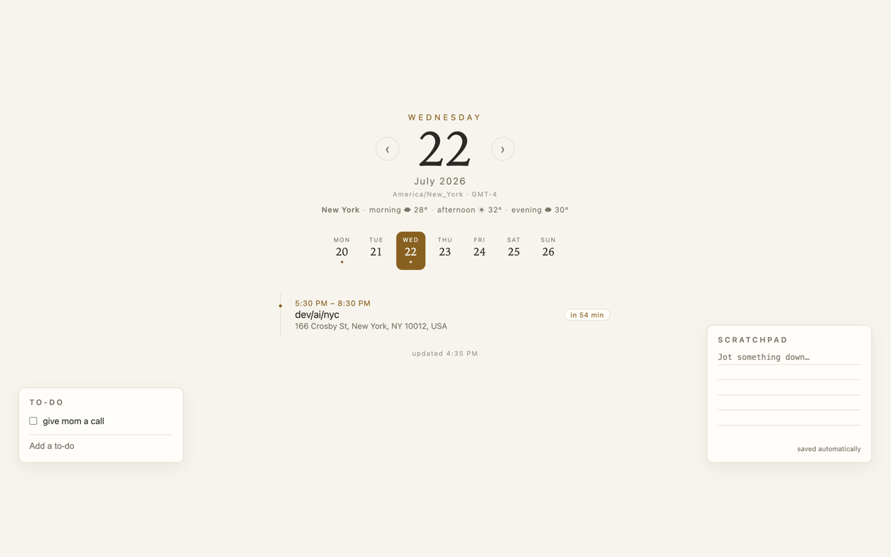
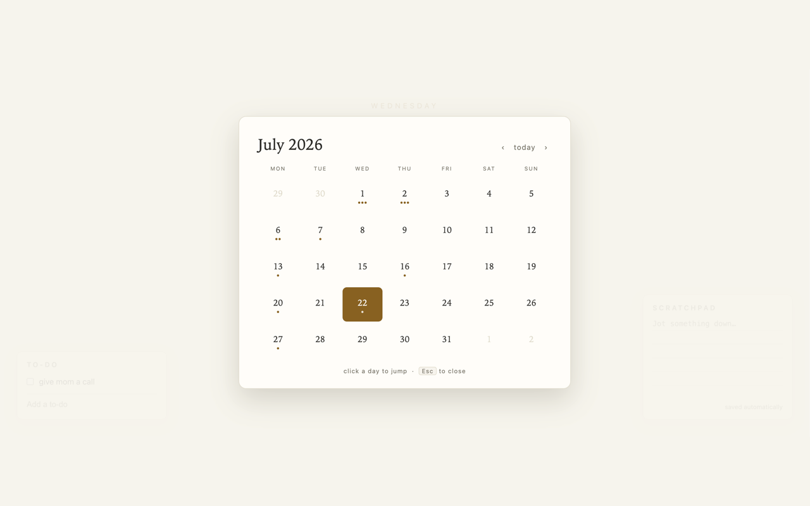

# Day Tab

A calm Chrome new-tab page: your Google Calendar day, a to-do list, a
scratchpad, and the day's weather — on paper and bronze, with nothing
fighting for your attention.





## Who it's for

You open dozens of tabs a day. Most new-tab pages spend that moment trying
to pull you somewhere — feeds, shortcuts, search. Day Tab does the
opposite: it uses that glance to orient you. What's next on the calendar,
how heavy the week looks, what you promised yourself you'd do, whether to
take an umbrella — then it gets out of the way.

It's for people who live by their Google Calendar, prefer quiet tools over
dashboards, and care where their data goes: Day Tab has no backend and no
analytics, and your calendar never leaves the browser.

## Features

- **Day view** of your Google Calendar (read-only): a time-ordered agenda
  with all-day events pinned on top, "in N min" pills on events starting
  within the hour, and ‹ › navigation between days.
- **Multiple calendars** — press `C` to pick which of your Google calendars
  to show (defaults mirror Google Calendar's sidebar); event markers are
  tinted per calendar.
- **Week strip** — seven cells with event-density dots; click to jump.
- **Month overlay** — press `M` or click the date numeral for a full month
  grid; click any day to jump there.
- **Weather line** — morning / afternoon / evening conditions and
  temperatures for the viewed day via [Open-Meteo](https://open-meteo.com)
  (keyless, no account), with rain risk highlighted.
- **To-do list** and **scratchpad**, synced across your Chrome profile.
- Timezone indicator, last-fetched stamp, Google Calendar deep links.

Events are fetched one week at a time and cached, so day navigation is
instant. Everything runs in the browser: no backend, no analytics — see
[PRIVACY.md](PRIVACY.md).

## Install

- **Chrome Web Store:** _coming soon._
- **From source:** see below.

> **WIP:** Google OAuth verification and Chrome Web Store review are in
> progress. Until they complete, connecting Google Calendar shows an
> "unverified app" warning (click *Advanced → continue* to proceed) — the
> app works fully; the warning disappears once verification is granted.

## Local setup

No build step, no dependencies — the repo is the extension.

```sh
git clone https://github.com/wenhongg/newtab.git
```

1. Open `chrome://extensions` in Chrome.
2. Turn on **Developer mode** (toggle, top right).
3. Click **Load unpacked** and select the cloned `newtab` folder.
4. Open a new tab — the to-do list, scratchpad, and weather (after typing a
   city) work immediately.
5. Click **Connect Google Calendar** — no OAuth setup needed. The
   extension ID is pinned in `manifest.json`, so the shipped OAuth client
   works for from-source installs too. (Until Google's verification
   completes you'll see an "unverified app" screen — *Advanced → continue*.)

## Structure

Vanilla JS ES modules, no build step. One folder per feature:

```
calendar/   day view, week strip, month overlay, Google Calendar API
todo/       checklist (chrome.storage.sync)
scratchpad/ autosaving notes (chrome.storage.sync)
weather/    Open-Meteo forecast line
shared/     storage helpers
```

## Privacy

Calendar data goes browser ↔ Google directly and is never stored. To-dos,
notes, and your weather city live in Chrome sync storage. The only third
party contacted is Open-Meteo, and only with a city name/coordinates.
Details in [PRIVACY.md](PRIVACY.md).

## License

[MIT](LICENSE)
